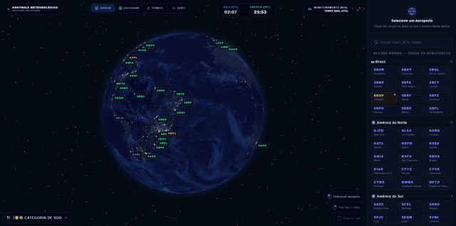
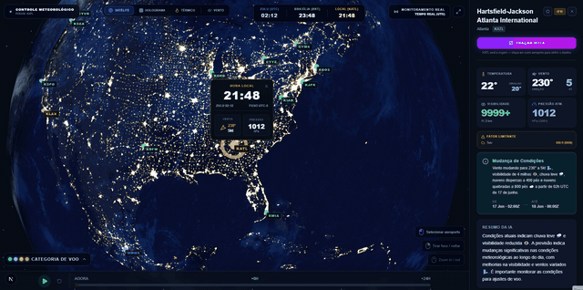
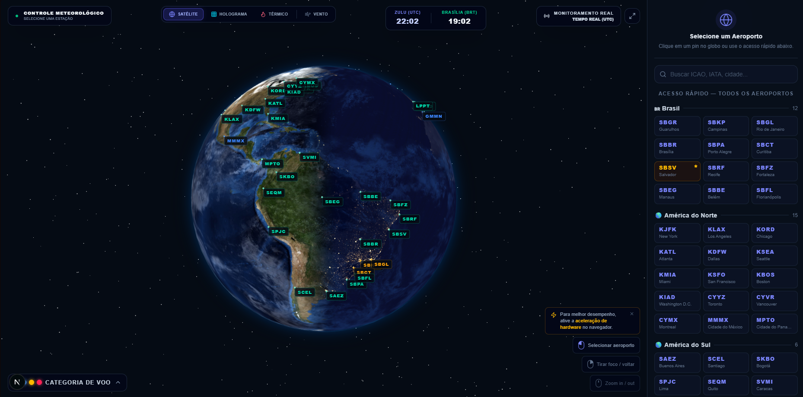
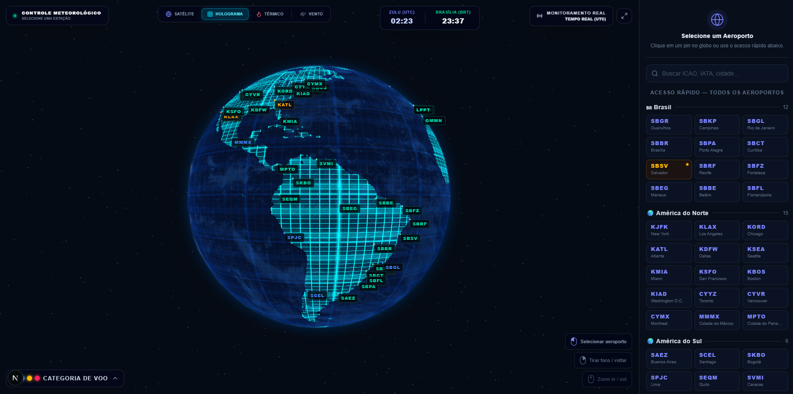
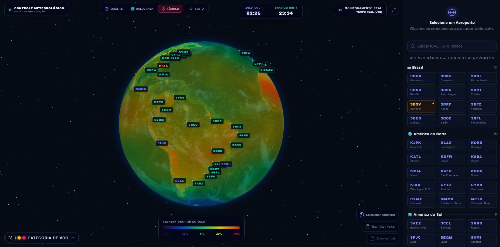

<div align="center">

# 🌐 Centro de Comando Meteorológico

**Dashboard de meteorologia aeronáutica com globo 3D em tempo real, dados METAR/TAF e briefings gerados por IA.**


<!-- ⚠️ PREENCHA estes dois links antes de publicar. O de demo é o mais importante. -->
[🔗 Demo ao vivo](COLOQUE_O_LINK_DO_DEPLOY_AQUI) · [📂 Código-fonte](COLOQUE_O_LINK_DO_REPO_AQUI)

</div>

<!--
  ================== MÍDIA PRINCIPAL (GIF HERÓI) ==================
  Substitua o caminho abaixo pelo seu GIF principal (~10-12s):
  globo girando → clique no pin → painel/briefing de IA → troca de modo.
  Salve o arquivo em: docs/demo.gif
-->
<div align="center">
  
</div>

---

## 💡 Sobre o Projeto

Esse projeto nasceu para resolver um problema real de quem trabalha com aviação: condições meteorológicas mudam rápido e dados brutos de METAR/TAF são difíceis de interpretar sob pressão. O **Centro de Comando Meteorológico** transforma esses dados em uma experiência visual — um globo 3D onde cada aeroporto é colorido pela sua categoria de voo (VFR/MVFR/IFR/LIFR), com previsão horária navegável e briefings em linguagem natural gerados por IA.

Foi construído como projeto pessoal para explorar a interseção entre **visualização 3D no browser**, **engenharia de dados meteorológicos em tempo real** e **integração com LLMs** — três áreas que normalmente não aparecem juntas em um único produto.

---

## 🧠 Destaques Técnicos

Pontos do projeto que considero mais interessantes do ponto de vista de engenharia:

- **Fila de prefetch com debounce e cancelamento** (`useFlightCategories.ts`): em vez de disparar 60+ requisições de uma vez, os METARs são buscados individualmente em fila sequencial, com cancelamento de efeitos via `AbortController` para evitar race conditions ao trocar de aba ou mover o slider rapidamente.
- **Fonte única de verdade para categoria de voo**: o badge da UI e o "fator limitante" exibido no painel lateral derivam do mesmo valor (`activeFlightCategory`), evitando o bug clássico de UI mostrando dois estados conflitantes a partir de fontes de dados diferentes (METAR vs. TAF).
- **Fallback gracioso de API**: se o CheckWX rejeitar uma lista grande de ICAOs, a rota retorna `200` com payload vazio em vez de propagar erro — os pins do globo simplesmente mantêm a última categoria conhecida, sem poluir o console ou quebrar a experiência.
- **Shaders GLSL customizados**: o modo satélite usa um shader de blend dia/noite baseado na posição solar real; o modo holograma usa um shader procedural de grid neon com scanlines; o modo térmico interpola uma colormap customizada a partir de dados de temperatura.
- **Fetch client-side para APIs públicas**: dados do Open-Meteo são buscados diretamente do browser (CORS-friendly, sem chave), evitando um round-trip inteiro pelo servidor Next.js e eliminando uma classe de falhas de rede.

### Decisões de arquitetura

Algumas escolhas conscientes de trade-off que valem ser explicadas:

- **Por que fila sequencial em vez de paralelismo total?** Com 60+ aeroportos, disparar tudo de uma vez derrubaria o rate limit do CheckWX e travaria a UI. A fila com cancelamento troca um pouco de latência total por uma experiência sempre responsiva e por respeito aos limites da API.
- **Por que fetch client-side no Open-Meteo, mas server-side no CheckWX?** O Open-Meteo é público, CORS-friendly e sem chave — passar pelo servidor só adicionaria latência e um ponto de falha. Já o CheckWX exige chave secreta, que **não pode** vazar para o browser, então fica atrás de uma rota de API.

---

## ✨ Funcionalidades

<!--
  ================== GIFs CURTOS DE APOIO ==================
  Os blocos  abaixo são para GIFs curtos (4-6s), um por feature.
  Mantenha-os FOCADOS em uma coisa só cada. Salve em docs/.
  Se não for gravar algum, apague o  correspondente — não deixe link quebrado.
-->

- 🌍 **Globo 3D interativo** com três modos de renderização: satélite com ciclo dia/noite baseado no horário UTC real, holograma cibernético e mapa térmico.

- 🛫 **Categorização de voo em tempo real** (VFR/MVFR/IFR/LIFR) com cores aplicadas dinamicamente a cada aeroporto.

- 💨 **Camada de vento** com partículas animadas, interpoladas a partir de dados grid do Open-Meteo.
  <div align="center">
    
  </div>

- ⏱️ **Timeline de previsão** — projeta condições até 24h no futuro combinando TAF + Open-Meteo, atualizando marcadores e painel para o horário escolhido.
  <div align="center">
    
  </div>

- ✈️ **Planejamento de rota** com cálculo de distância ortodrômica (haversine) entre dois aeroportos e arco animado sobre o globo.
  <div align="center">
    
  </div>

- 🤖 **Briefing de IA em português** — resume condições atuais/futuras e gera alertas a partir de grupos de mudança do TAF (TEMPO/BECMG/FM).

- 🔄 **Sincronização incremental de METARs** com indicador visual de progresso, evitando travar a UI com 60+ requisições simultâneas.

- ⭐ Busca, favoritos e agrupamento de aeroportos por região.

---

## 🖼️ Modos de Visualização

<!--
  ================== PRINTS ESTÁTICOS ==================
  Os três modos do globo funcionam melhor como prints lado a lado do que como GIF
  (comparar é mais fácil parado). Tire um print de cada modo e salve em docs/.
  O print que você já tirou (tela inicial / satélite) entra como o primeiro.
-->

| Satélite | Holograma | Térmico |
|:---:|:---:|:---:|
|  |  |  |
| Ciclo dia/noite real | Grid neon + scanlines | Colormap de temperatura |

---

## 🛠️ Stack

| Camada | Tecnologia |
|---|---|
| Framework | Next.js 16 (App Router) |
| UI | React 19 + TypeScript 5 |
| 3D | Three.js + React Three Fiber + Drei |
| Animações | Framer Motion + React Spring |
| Estilos | Tailwind CSS 4 |
| Estado global | Zustand 5 (com persistência em localStorage) |
| IA | Groq API (Llama 3.3 70B) |
| Dados meteorológicos | CheckWX API + Open-Meteo |

---

## 🔌 APIs Utilizadas

| API | Finalidade | Chave necessária? |
|---|---|---|
| **Groq** (Llama 3.3 70B) | Briefings meteorológicos em português | Sim |
| **CheckWX** | METAR e TAF decodificados | Sim (com fallback de dados simulados) |
| **Open-Meteo** | Previsão horária e camada de vento global | Não (gratuita, sem chave) |

---

## 🎯 Categorias de Voo

Critérios seguem o padrão aeronáutico (visibilidade em metros, teto em pés acima do solo). O fator mais restritivo entre visibilidade e teto define a categoria.

| Categoria | Cor | Critério |
|---|---|---|
| **VFR** | Azul | Teto ≥ 3.000 ft **e** visibilidade ≥ 8.000 m |
| **MVFR** | Verde | Teto 1.000–3.000 ft **ou** visibilidade 5.000–8.000 m |
| **IFR** | Vermelho | Teto 500 a < 1.000 ft **ou** visibilidade 1.600 a < 5.000 m |
| **LIFR** | Magenta | Teto < 500 ft **ou** visibilidade < 1.600 m |

---

## 🚀 Como Rodar Localmente

### Pré-requisitos

<!-- ⚠️ CONFIRA a versão mínima de Node exigida pelo Next.js 16 e ajuste o número abaixo. -->
- Node.js 20+
- npm

```bash
# 1. Clonar o repositório
git clone https://github.com/SEU-USUARIO/centro-comando-meteorologico.git
cd centro-comando-meteorologico

# 2. Instalar dependências
npm install

# 3. Configurar variáveis de ambiente
cp .env.example .env.local
```

Edite `.env.local`:

```env
GROQ_API_KEY=sua_chave_groq
CHECKWX_API_KEY=sua_chave_checkwx
```

> Sem `CHECKWX_API_KEY` o app usa dados METAR/TAF simulados. Sem `GROQ_API_KEY` o briefing de IA é desativado, mas os alertas extraídos do TAF continuam funcionando.

```bash
# 4. Rodar em desenvolvimento
npm run dev
```

Acesse [http://localhost:3000](http://localhost:3000).

---

## 📁 Estrutura do Projeto

```
src/
├── app/
│   ├── api/                  # Rotas de backend (METAR, TAF, vento, IA)
│   └── page.tsx              # Página principal
├── components/
│   ├── globe/                # Cena 3D, marcadores, partículas de vento, rotas, shaders
│   ├── sidebar/              # Painel lateral com briefing e dados do aeroporto
│   ├── timeline/             # Controles de tempo e slider de previsão
│   ├── alerts/               # Cards de alertas meteorológicos
│   └── ui/                   # Header, busca, badge de categoria
├── hooks/                    # useFlightCategories, useStationSelect, useWindData
├── store/                    # Zustand store global
├── lib/
│   ├── weather/              # Cliente CheckWX e parser de TAF
│   ├── groq/                 # Cliente Groq para briefings de IA
│   └── three/                # Utilitários de geolocalização 3D
├── data/
│   └── airports.ts           # Base de 60+ aeroportos globais
└── types/
    └── index.ts              # Interfaces TypeScript
```

---

## 🗺️ Possíveis Próximos Passos

- [ ] Histórico de METAR/TAF com gráfico de tendência
- [ ] Modo offline com cache de última sincronização
- [ ] Exportação de briefing em PDF
- [ ] Testes automatizados (Vitest/Playwright)

---

## 👤 Autor

Feito por **[Seu Nome]**.

<!-- ⚠️ PREENCHA seus links reais. Perfil sem link cheira a projeto inacabado. -->
- LinkedIn: [seu-usuario](COLOQUE_O_LINK_AQUI)
- GitHub: [seu-usuario](COLOQUE_O_LINK_AQUI)
- Portfólio: [seu-site](COLOQUE_O_LINK_AQUI)

---

## 📄 Licença

MIT
